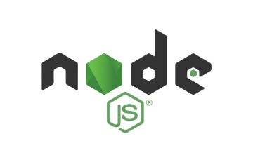
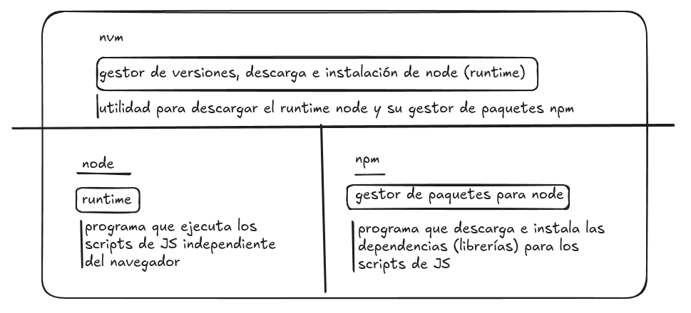

# Node


## Descripción

Node o (node.js) es una **plataforma de ejecución** (runtime) que permite ejecutar **JavaScript fuera del navegador**.

### Qué es y cómo funciona

- **Motor**: se basa en **V8** (el motor de JavaScript del navegador Chrome) para ejecutar con compilación JIT.
    
- **Modelo de concurrencia**: **event-driven (orientado a eventos)**  y **I/O no bloqueante** (asíncrono). Un **event loop** (libuv) orquesta las operaciones y usa un _thread pool_ interno para tareas de E/S pesadas.

>**[libuv](https://libuv.org/)** 
>es una biblioteca de C para E/S asíncrona y de eventos, escrita para [Node.js](https://nodejs.org/) y usada para abstraer operaciones del sistema operativo. 
>
>Proporciona un [bucle de eventos](https://www.google.com/search?safe=active&sca_esv=b6b0734220a77ce1&cs=1&q=bucle+de+eventos&sa=X&ved=2ahUKEwiEoIaUhvyPAxVhSaQEHS8JA4kQxccNegQIAxAB&mstk=AUtExfDAAFFAWEC4cJCUTCEEpj5gnYtzbZ1AITKdWaRJ6_V4tait_tIkgUW475DDIrYhY0-kuoaWkNWrmbnNt4p7A0I8JpGw3Al12JBVFO-eEFr9hBBiV3G8_2uCuBAyIBeve-s&csui=3) y un conjunto de herramientas para gestionar operaciones de E/S de red y de sistemas de archivos, así como la creación de un thread pool para operaciones bloqueantes, todo de forma [multiplataforma](https://www.google.com/search?safe=active&sca_esv=b6b0734220a77ce1&cs=1&q=multiplataforma&sa=X&ved=2ahUKEwiEoIaUhvyPAxVhSaQEHS8JA4kQxccNegQIAxAC&mstk=AUtExfDAAFFAWEC4cJCUTCEEpj5gnYtzbZ1AITKdWaRJ6_V4tait_tIkgUW475DDIrYhY0-kuoaWkNWrmbnNt4p7A0I8JpGw3Al12JBVFO-eEFr9hBBiV3G8_2uCuBAyIBeve-s&csui=3). 
>
>Al igual que libuv permite que Node.js maneje operaciones sin bloquear el hilo principal de ejecución, también actúa como un puente entre el código de JavaScript y las capacidades de bajo nivel del sistema operativo.
    
- **Hilo principal**: el código JS corre en un solo hilo; para aprovechar varios núcleos se usan **cluster** o **worker_threads**.
    
- **Módulos y paquetes**: soporta **CommonJS** (`require`) y **ES Modules** (`import`). Su ecosistema se gestiona con **npm** (o pnpm/yarn).
    

### Para qué se usa

- Servidores web y APIs REST/GraphQL.
    
- Apps **en tiempo real** (WebSockets): chats, dashboards.
    
- Microservicios, herramientas de línea de comandos, _streaming_ de datos, IoT.
    
- Compartir lenguaje front/back (JS/TS).
    

### Ventajas y límites

**Ventajas**

- Alto rendimiento en **miles de conexiones concurrentes** de E/S.
    
- Gran ecosistema de paquetes.
    
- Desarrollo rápido y homogéneo con **JavaScript/TypeScript**.
    

**Límites**

- No es ideal para **tareas CPU-intensivas** puras (mejor delegarlas a workers o servicios aparte).
    
- La **asincronía** exige buenas prácticas (promesas/`async/await`, manejo de errores).

### Instalación

Para instalar node vamos a emplear un gestor de versiones de node conocido como nvm


[Script de descarga para linux](https://nodejs.org/es/download)

```bash
# Descarga e instala nvm:
curl -o- https://raw.githubusercontent.com/nvm-sh/nvm/v0.40.3/install.sh | bash

# en lugar de reiniciar la shell
\. "$HOME/.nvm/nvm.sh"

# Descarga e instala Node.js:
nvm install 22

# Verify the Node.js version:
node -v # Should print "v22.20.0".

# Verifica versión de npm:
npm -v # Debería mostrar "10.9.3".
```

Con la aplicación del script anterior vamos a instalar **nvm**, **node** y **npm** en nuestro sistema linux. 


Respecto de node se instalará la última versión LTS (Long-Term-Support), actualmente 22. Una vez instalado puedes comprobar su funcionamiento invocándolo directamente del terminal:

```bash
user@ubu:~$ node -v
v22.19.0
user@ubu:~$ node
Welcome to Node.js v22.19.0.
Type ".help" for more information.
> let a = 'hello, world'
undefined
> a
'hello, world'
> console.log(a)
hello, world
undefined
> 

#(Ctrl+C 2 veces para salir)

```

## vscode

Crea un directorio nuevo **proyecto_js** y en él ejecuta **code .** desde el terminal.


A continuación pulsa en la opción de la carpeta de **New File**


Crea un fichero con extensión **.js**

A continuación para ejecutar pulsa en la sección de ejecución símbolo del play y el *bug*


## JavaScript (JS) Tutoriales

[javascript.info](https://es.javascript.info/)

### Fundamentos de JavaScript

[Fundamentos de JavaScript](https://es.javascript.info/first-steps)

- [¡Hola, mundo!](https://es.javascript.info/hello-world)
    
- [Estructura del código](https://es.javascript.info/structure)
    
- [El modo moderno, "use strict"](https://es.javascript.info/strict-mode)
    
- [Variables](https://es.javascript.info/variables)
    
- [Tipos de datos](https://es.javascript.info/types)
    
- [Interacción: alert, prompt, confirm](https://es.javascript.info/alert-prompt-confirm)
    
- [Conversiones de Tipos](https://es.javascript.info/type-conversions)
    
- [Operadores básicos, matemáticas](https://es.javascript.info/operators)
    
- [Comparaciones](https://es.javascript.info/comparison)
    
- [Ejecución condicional: if, '?'](https://es.javascript.info/ifelse)
    
- [Operadores Lógicos](https://es.javascript.info/logical-operators)
    
- [Operador Nullish Coalescing '??'](https://es.javascript.info/nullish-coalescing-operator)
    
- [Bucles: while y for](https://es.javascript.info/while-for)
    
- [La sentencia "switch"](https://es.javascript.info/switch)
    
- [Funciones](https://es.javascript.info/function-basics)
    
- [Expresiones de función](https://es.javascript.info/function-expressions)
    
- [Funciones Flecha, lo básico](https://es.javascript.info/arrow-functions-basics)
    
- [Especiales JavaScript](https://es.javascript.info/javascript-specials)

### Tipos de datos

[Tipos de datos](https://es.javascript.info/data-types)

- [Métodos en tipos primitivos](https://es.javascript.info/primitives-methods)
    
- [Números](https://es.javascript.info/number)
    
- [Strings](https://es.javascript.info/string)
    
- [Arrays](https://es.javascript.info/array)
    
- [Métodos de arrays](https://es.javascript.info/array-methods)
    
- [Iterables](https://es.javascript.info/iterable)
    
- [Map y Set](https://es.javascript.info/map-set)
    
- [WeakMap y WeakSet](https://es.javascript.info/weakmap-weakset)
    
- [Object.keys, values, entries](https://es.javascript.info/keys-values-entries)
    
- [Asignación desestructurante](https://es.javascript.info/destructuring-assignment)
    
- [Fecha y Hora](https://es.javascript.info/date)
    
- [Métodos JSON, toJSON](https://es.javascript.info/json)


### Otros tutoriales

[lenguajejs.com](https://lenguajejs.com/javascript/)

[freecodecamp.org](https://www.freecodecamp.org/learn/javascript-algorithms-and-data-structures-v8/)

[theodinproject.com](https://www.theodinproject.com/paths/full-stack-javascript)

### Vídeos

**Event Loop de JS**

<iframe width="1000" height="500" src="https://www.youtube.com/embed/eiC58R16hb8?si=RYcO3zH12YQpJEm0" title="YouTube video player" frameborder="0" allow="accelerometer; autoplay; clipboard-write; encrypted-media; gyroscope; picture-in-picture; web-share" referrerpolicy="strict-origin-when-cross-origin" allowfullscreen></iframe>
