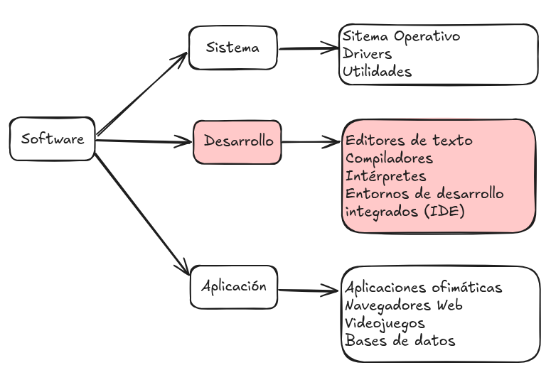

# 1. Software y programa. Tipos de software.

## Diferencias hardware/software

El ordenador se compone de dos partes bien diferenciadas: **hardware** y **software**.

El **software** son las instrucciones y datos que permiten a un ordenador o dispositivo electrónico realizar tareas específicas. 

A diferencia del **hardware** (la parte física del sistema), el **software** es intangible y se encarga de indicar al hardware cómo debe operar.

## Tipos de software

Según su función se distinguen **3 tipos de software**:

Nuestro interés se centra en cómo se desarrollan las aplicaciones informáticas y cuáles son las fases por las que necesariamente ha de pasar su desarrollo. No obstante, es importante tener claras las 3 categorías 

El **software de sistema** es el software base que ha de estar instalado y configurado en nuestro ordenador para que las aplicaciones puedan ejecutarse y funcionar. Son ejemplos de sistemas operativos: Windows, Linux, Unix, Mac OS X, Android, IOS.

El **software de desarrollo** o programación es el conjunto de herramientas que nos permiten desarrollar programas informáticos. 

Por último, las **aplicaciones** son un conjunto de programas que tienen una finalidad concreta.  Ejemplos de aplicaciones son: un procesador de textos, una hoja de cálculo, el software para reproducir música, un videojuego, etc.