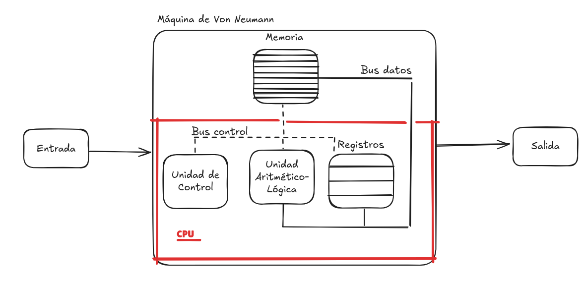
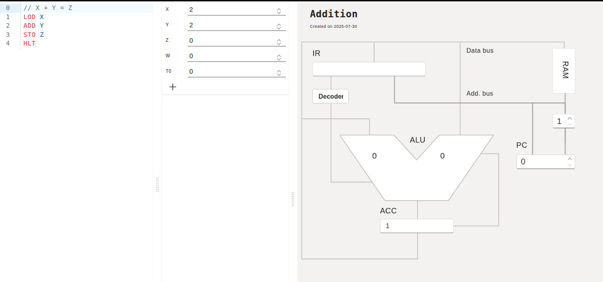
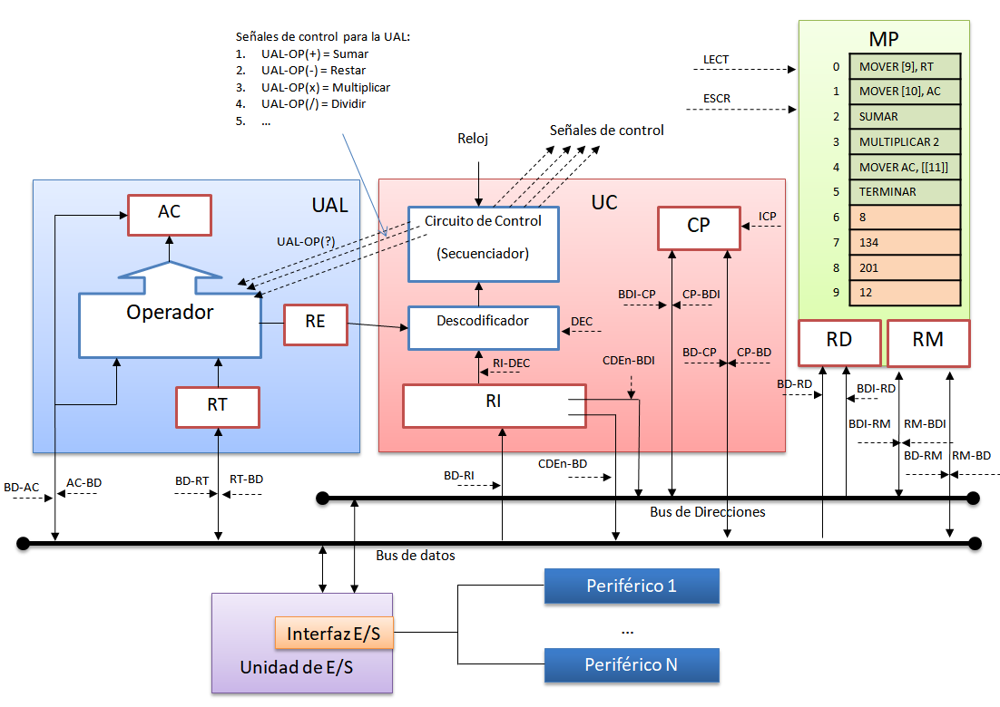
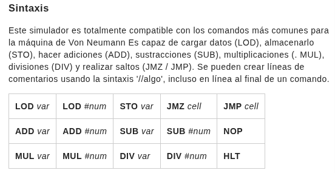
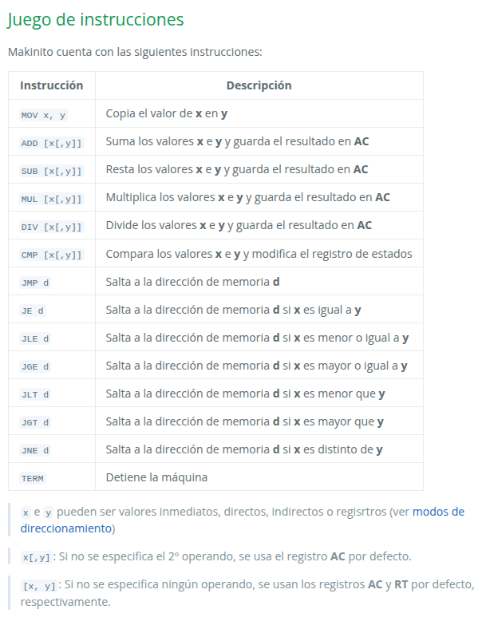
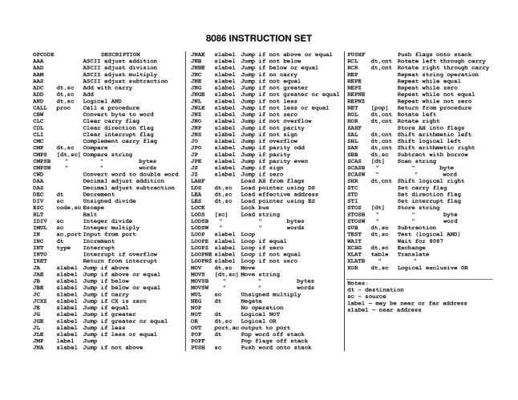

# 2. Relación hardware-software.

## Máquina de Von-Neumann

Al conjunto de dispositivos físicos que conforman un ordenador se le denomina hardware. 

Existe una relación indisoluble entre éste y el software, ya que ambos necesitan estar instalados y configurados correctamente para que el equipo funcione.

La primera arquitectura hardware con programa almacenado se estableció en 1946 por [John Von Neumann](https://es.wikipedia.org/wiki/John_von_Neumann). 

Se trata de una arquitectura básica que nos da una noción de cómo operan los ordenadores modernos, ya que éstos respetan esta estructura, pero con una complejidad infinitamente mayor.



En el modelo de **Von Neumann** existe una Memoria Principal (RAM) que almacena los datos y las instrucciones del programa a ejecutar.  El programa lee los datos y realiza una serie de operaciones con ellos hasta obtener los resultados que tiene como objeto.

Estas instrucciones de programa son decodificadas por una Unidad de Control  en base a una electrónica específica que envia las señales eléctricas para coordinar los diferentes bloques  en la ejecución de las instrucciones. 

> Nota: el ordenador es una máquina electrónica que opera con señales eléctricas de voltaje que representan 1s y 0s utilizados para codificar toda la información, es decir, los datos y las instrucciones del programa que quiere transformar esos datos.

Se tendrá un bloque de Unidad Aritmético-Lógica (ALU) que realiza operaciones aritmético-lógicas básicas. Y un bloque o banco de registros donde se almacenan resultados preliminares de las instrucciones a ejecutar.

En el enlace siguiente se puede encontrar un simulador básico de arquitectura de Von Neumann: [simulador de Von Neumann online](https://vnmsim.c2r0b.ovh/en-us)




También, existen simuladores más complejos como [Makinito](https://asir-fuw.github.io/Makinito/) 




Un aspecto a destacar en la arquitectura de computadores será el **juego de instrucciones**. Por ejemplo, en el caso del simulador [online](https://vnmsim.c2r0b.ovh/en-us) se tiene el siguiente juego de instrucciones:



Mientras que [Makinito](https://asir-fuw.github.io/Makinito/) tiene el siguiente juego de instrucciones:



Nada que ver con el [juego de instrucciones ](https://yjdoc2.github.io/8086-emulator-web/help)de un procesador *moderno* como [8086](https://yjdoc2.github.io/8086-emulator-web/compile):



Otro simulador de interés sería [VonSim](https://vonsim.github.io/) que simula el **juego de instrucciones** del primer procesador comercial [8088](https://es.wikipedia.org/wiki/Intel_8086_y_8088) a gran escala.

En este sentido, cabe destacar que una **aplicación** no es más que un **conjunto de programas** escritos en algún **lenguaje de programació**n con sentencias de un idioma que el ser humano puede aprender y usar fácilmente. 

A continuación, puedes ver un programa Java básico que realiza la suma de 2 números solicitados por consola. Está escrito en un lenguaje próximo al lenguaje humano: **lenguaje de alto nivel**.

```java
import java.util.Scanner;

public class SumaDosNumeros {
    public static void main(String[] args) {
        // Crear un objeto Scanner para leer desde el teclado
        Scanner scanner = new Scanner(System.in);

        // Solicitar el primer número
        System.out.print("Introduce el primer número: ");
        int numero1 = scanner.nextInt();

        // Solicitar el segundo número
        System.out.print("Introduce el segundo número: ");
        int numero2 = scanner.nextInt();

        // Calcular la suma
        int suma = numero1 + numero2;

        // Mostrar el resultado
        System.out.println("La suma de " + numero1 + " y " + numero2 + " es: " + suma);
        
        // Cerrar el scanner
        scanner.close();
    }
}

```

Por otra parte, el hardware de un ordenador, **procesador o CPU**, sólo es capaz de interpretar **instrucciones** específicas de su **juego de instrucciones**. El decodificador/unidad de control traducirá estas instrucciones a señales de control que enviará a la circuitería electrónica de la máquina para realizar alguna operación. 

Hace falta una herramienta que establezca la unión entre este **lenguaje de programación de alto nivel**, próximo al humano, y el **juego de instrucciones** (instrucciones ensamblador) que entiende el procesador. 

>Este nexo de unión será:
>
> 	==una **herramienta de desarrollo** llamada **compilador** o **intérprete**.==
> 	

Si *compilamos* a código **ensamblador**, es decir, en el juego de instrucciones de una CPU general moderna, el programa anterior de **SumaDosNumeros**, obtenemos (ver: [java-to-assembly-converter](https://www.codeconvert.ai/java-to-assembly-converter)   [godbolt](https://godbolt.org/)):

```asm
section .data
    prompt1 db "Introduce el primer número: ", 0
    prompt2 db "Introduce el segundo número: ", 0
    result_msg db "La suma de ", 0
    result_msg2 db " y ", 0
    result_msg3 db " es: ", 0
    num1 db 0
    num2 db 0
    suma db 0

section .bss
    input1 resb 10
    input2 resb 10

section .text
    global _start

_start:
    ; Solicitar el primer número
    mov rax, 1          ; syscall: write
    mov rdi, 1          ; file descriptor: stdout
    mov rsi, prompt1
    mov rdx, 30
    syscall

    ; Leer el primer número
    mov rax, 0          ; syscall: read
    mov rdi, 0          ; file descriptor: stdin
    mov rsi, input1
    mov rdx, 10
    syscall

    ; Convertir el primer número de string a entero
    mov rsi, input1
    call atoi
    mov [num1], al

    ; Solicitar el segundo número
    mov rax, 1
    mov rdi, 1
    mov rsi, prompt2
    mov rdx, 30
    syscall

    ; Leer el segundo número
    mov rax, 0
    mov rdi, 0
    mov rsi, input2
    mov rdx, 10
    syscall

    ; Convertir el segundo número de string a entero
    mov rsi, input2
    call atoi
    mov [num2], al

    ; Calcular la suma
    mov al, [num1]
    add al, [num2]
    mov [suma], al

    ; Mostrar el resultado
    mov rax, 1
    mov rdi, 1
    mov rsi, result_msg
    mov rdx, 30
    syscall

    ; Mostrar primer número
    mov rax, [num1]
    call print_num

    mov rax, 1
    mov rdi, 1
    mov rsi, result_msg2
    mov rdx, 30
    syscall

    ; Mostrar segundo número
    mov rax, [num2]
    call print_num

    mov rax, 1
    mov rdi, 1
    mov rsi, result_msg3
    mov rdx, 30
    syscall

    ; Mostrar suma
    mov rax, [suma]
    call print_num

    ; Salir
    mov rax, 60         ; syscall: exit
    xor rdi, rdi        ; status: 0
    syscall

atoi:
    ; Convert string to integer
    xor rax, rax        ; Clear rax
    xor rcx, rcx        ; Clear rcx
atoi_loop:
    movzx rbx, byte [rsi + rcx] ; Load byte from string
    cmp rbx, 10        ; Check for newline
    je atoi_done
    sub rbx, '0'       ; Convert ASCII to integer
    imul rax, rax, 10  ; Multiply rax by 10
    add rax, rbx       ; Add the new digit
    inc rcx            ; Move to the next character
    jmp atoi_loop
atoi_done:
    ret

print_num:
    ; Print number in rax
    ; Convert number to string and print
    ; Implementation omitted for brevity
    ret
```