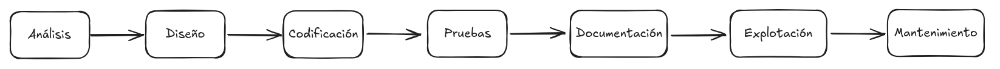
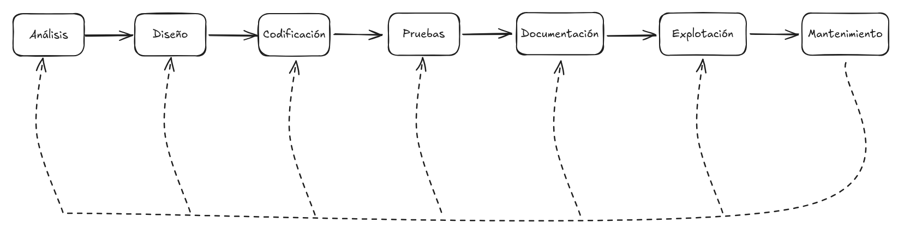
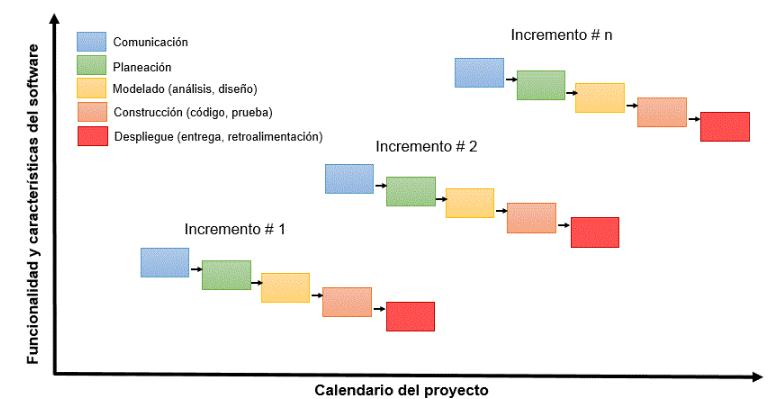
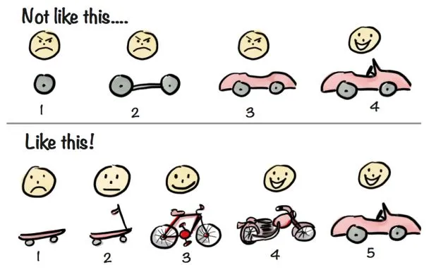
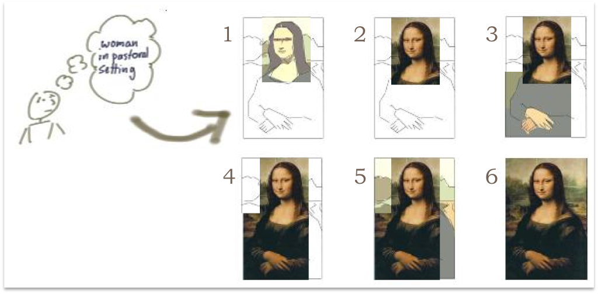
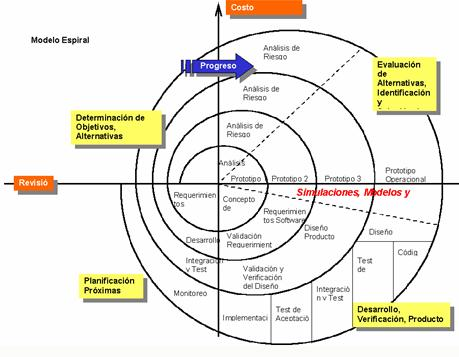

# 3. Desarrollo de Software.

## Desarrollo de Software

Entendemos por Desarrollo de Software:

>el proceso que ocurre desde que se concibe una idea hasta que un programa está implementado en el ordenador y funcionando.

<a href="./imagenes/ciclo_desarrollo.png" target="_blank">Ampliar</a>

El proceso de desarrollo, que en un principio puede parecer una tarea simple, consta de una serie de pasos de *obligado cumplimiento*, pues sólo así puede garantizarse que los
programas creados son eficientes, fiables, seguros y responden a las necesidades de usuarios finales (aquéllos que van a utilizar el programa).

## Metodologías clásicas

Etapas metodologías clásicas de desarrollo:

#### 1. Análisis

Es la etapa en la que se identifican y comprenden **los requisitos** del sistema a desarrollar. Aquí se responde a **qué necesita el cliente o usuario final** y **qué debe hacer el software**.  
Incluye:

- Recolección de requisitos.
    
- Estudio de viabilidad.
    
- Análisis funcional y no funcional.
    

_Objetivo:_ Comprender el problema y establecer una base clara para el diseño.

#### 2. Diseño

Consiste en definir **cómo se va a construir** el software. Se estructura la solución técnica que cumple con los requisitos analizados.  
Se divide comúnmente en:

- Diseño de arquitectura (estructuras, módulos, interfaces).
    
- Diseño detallado (algoritmos, estructuras de datos, esquemas de base de datos).
    

_Objetivo:_ Plasmar una solución técnica bien definida, antes de programar.

#### 3. Codificación

Es la etapa donde los diseñadores y programadores **escriben el código fuente** en uno o varios lenguajes de programación.  
Se implementan los módulos definidos en el diseño.

_Objetivo:_ Transformar el diseño en software funcional.

#### 4. Pruebas

El software desarrollado se **verifica y valida** para asegurarse de que cumple con los requisitos establecidos.  
Incluye:

- Pruebas unitarias (módulos individuales).
    
- Pruebas de integración (conjuntos de módulos).
    
- Pruebas del sistema (comportamiento general).
    
- Pruebas de aceptación (por parte del cliente o usuario).
    

_Objetivo:_ Detectar y corregir errores antes de la entrega.

### 5. Documentación

Consiste en crear y mantener **manuales técnicos y de usuario** que expliquen cómo se ha construido y cómo se usa el software.  
Puede incluir:

- Manual de instalación.
    
- Guía del usuario.
    
- Documentación técnica del código.
    

 _Objetivo:_ Facilitar el uso, la comprensión y la futura evolución del software.

#### 6. Explotación (Despliegue o implantación)

Es el proceso de **poner el software en funcionamiento** en el entorno real de los usuarios finales.  
Incluye:

- Instalación.
    
- Configuración.
    
- Capacitación de usuarios.
    

 _Objetivo:_ Que el software empiece a ser utilizado productivamente.

#### 7. Mantenimiento

Después del despliegue, se realiza el mantenimiento para **corregir errores, mejorar funcionalidades o adaptarse a cambios** (por ejemplo, en el entorno o nuevas necesidades del cliente).  
Tipos:

- Correctivo (errores).
    
- Perfectivo (mejoras).
    
- Adaptativo (cambios externos).
    

 _Objetivo:_ Mantener el software útil, seguro y actualizado en el tiempo.

Tabla resumen de las etapas clásicas:

| **Etapa**            | **Descripción**                                                          | **Objetivo Principal**                                |
| -------------------- | ------------------------------------------------------------------------ | ----------------------------------------------------- |
| **1. Análisis**      | Identificación y comprensión de los requisitos del sistema.              | Qué necesita el usuario y qué debe hacer el software. |
| **2. Diseño**        | Planificación técnica de la solución: arquitectura, módulos, interfaces. | Cómo se construirá el software.                       |
| **3. Codificación**  | Programación del sistema conforme al diseño técnico.                     | Traducir el diseño en código funcional.               |
| **4. Pruebas**       | Verificación y validación del software para detectar y corregir errores. | Asegurar que el software funciona correctamente.      |
| **5. Documentación** | Creación de manuales técnicos y de usuario.                              | Facilitar el uso y mantenimiento del sistema.         |
| **6. Explotación**   | Puesta en marcha del software en el entorno real.                        | Los usuarios pueden utilizar el software.             |
| **7. Mantenimiento** | Corrección de errores, mejoras y adaptación a nuevos requisitos.         | Mantener el software útil, eficiente y actualizado.   |
Ya hemos visto que la serie de pasos a seguir para desarrollar un programa es lo que se conoce como **Ciclo de Vida del Software**.

## Ciclo de Vida del Software

Se han planteado distintos *modelos de ciclos de vida*, pero los más conocidos y utilizados son:

###  1. Modelo en Cascada (Waterfall)

**Definición:**  
Es un modelo **secuencial** donde el desarrollo avanza paso a paso (etapa por etapa), sin retroceder. Cada fase (análisis, diseño, codificación, pruebas, etc.) debe completarse antes de pasar a la siguiente.

**Características:**

- Proceso lineal.
    
- La documentación es clave.
    
- Poco flexible ante cambios.
    

**Ventajas:**

- Sencillo de planificar y gestionar.
    
- Adecuado cuando los requisitos están bien definidos desde el inicio.
    

**Inconvenientes:**

- No se adapta bien a cambios posteriores.
    
- El producto final no se ve hasta las últimas fases.
    

**Cuándo se usa:**  
Proyectos pequeños o bien definidos desde el principio.

###  2. Modelo en Cascada con Realimentación

**Definición:**  
Es una mejora del modelo en cascada tradicional que permite **retroalimentación** (volver a fases anteriores si se detectan errores o cambios).

**Características:**

- Añade **flexibilidad** al proceso.
    
- Permite revisar decisiones pasadas si surgen problemas en etapas posteriores.
    

**Ventajas:**

- Mayor capacidad de corrección.
    
- Reducción de errores graves acumulados.
    

**Inconvenientes:**

- Aumenta el tiempo y coste si se retrocede frecuentemente.
    

**Cuándo se usa:**  
Cuando el cliente puede cambiar de opinión o los requisitos no son del todo estables.

<a href="./imagenes/cascada_realimentado.png" target="_blank">Ampliar</a>

### 3. Modelo Evolutivo - Iterativo - Incremental

**Definición:**  
El software se desarrolla en **múltiples versiones o incrementos**. Cada versión añade nuevas funcionalidades y se entrega al usuario para recibir retroalimentación.

**Características:**

- Desarrollos **parciales y sucesivos**.
    
- **Iteración:** se repite el ciclo desarrollo-pruebas-mejoras.
    
- **Incremental:** cada entrega mejora la anterior.
    

**Ventajas:**

- Permite una entrega temprana de versiones útiles.
    
- Se adapta bien a cambios durante el desarrollo.
    
- Implica al cliente en el proceso.
    

**Inconvenientes:**

- Puede requerir una buena gestión de versiones.
    
- Más complejo de planificar.
    

**Cuándo se usa:**  
Proyectos medianos o grandes con requisitos cambiantes o no del todo claros.

<a href="./imagenes/modelo_incremental.png" target="_blank">Ampliar</a>

Interpretación del modelo iterativo incremental:

>La idea fundamental detrás de la mejora iterativa es desarrollar un sistema de software incrementalmente, permitiendo al desarrollador aprovechar lo que se va aprendiendo durante el desarrollo de las versiones tempranas, incrementales y entregables del sistema. 
>
>El aprendizaje viene tanto del desarrollo como del uso del sistema, donde sea posible. 
>
>Los pasos clave en el proceso consisten en empezar con una implementación sencilla de un subconjunto de los requisitos del software y mejorar iterativamente la evolución secuencial de versiones hasta que el sistema está implementado.
>
>En cada iteración, se hacen modificaciones en el diseño a la misma vez que añadimos nuevas funcionalidades.

<a href="./imagenes/modelo_incremental_metafora2.png" target="_blank">Ampliar</a>

Fuente https://blog.jmbeas.es/2019/09/22/desarrollo-iterativo-e-incremental/

###  4. Modelo en Espiral

**Definición:**  
Combina características del modelo iterativo con técnicas de **gestión de riesgos**. Se desarrolla en ciclos (espirales), y en cada uno se evalúan los riesgos y se construye un prototipo.

**Características:**

- Cada espiral incluye: planificación, análisis de riesgos, desarrollo, evaluación.
    
- Gran énfasis en la **gestión de riesgos**.
    

**Ventajas:**

- Excelente para proyectos grandes y críticos.
    
- Control continuo de riesgos.
    
- Fomenta la mejora progresiva.
    

**Inconvenientes:**

- Complejo de gestionar.
    
- Costoso si el análisis de riesgos no se aprovecha bien.
    

**Cuándo se usa:**  
Proyectos grandes, costosos, innovadores o con alto nivel de incertidumbre.

<a href="./imagenes/modelo_espiral.png" target="_blank">Ampliar</a>
## CASE o herramientas de apoyo

**CASE (Computer Aided Software Engineering)** hace referencia al conjunto de **herramientas y metodologías asistidas por ordenador** que apoyan y automatizan, total o parcialmente, las diferentes fases del ciclo de vida del software.

Aplicaciones o entornos que facilitan el desarrollo de software, proporcionando soporte desde la **análisis y diseño**, hasta la **implementación, pruebas, documentación y mantenimiento**.

- **Objetivos principales:**
    
    - Mejorar la **productividad** de los equipos de desarrollo.
        
    - Aumentar la **calidad** del software generado.
        
    - Reducir **costes** y **tiempos** en el proceso de desarrollo.
        
    - Garantizar una mejor **documentación** y trazabilidad del proyecto.
        
- **Tipos de herramientas CASE:**
    
    - **Upper CASE**: apoyan fases iniciales (análisis, modelado, diseño). Ej: herramientas UML, modeladores de BD.
        
    - **Lower CASE**: enfocadas en fases posteriores (codificación, pruebas, mantenimiento). Ej: generadores de código, depuradores.
        
    - **Integrated CASE (I-CASE)**: cubren prácticamente todo el ciclo de vida.
        
- **Funciones comunes:**
    
    - Modelado de procesos y datos (diagramas UML, ER).
        
    - Generación automática de código y documentación.
        
    - Gestión de versiones y configuración.
        
    - Pruebas automáticas.
        
    - Control de proyectos y métricas.
        
- **Ventajas:**
    
    - Consistencia entre diseño y código.
        
    - Facilita el trabajo en equipo.
        
    - Mejora la mantenibilidad y portabilidad del software.
